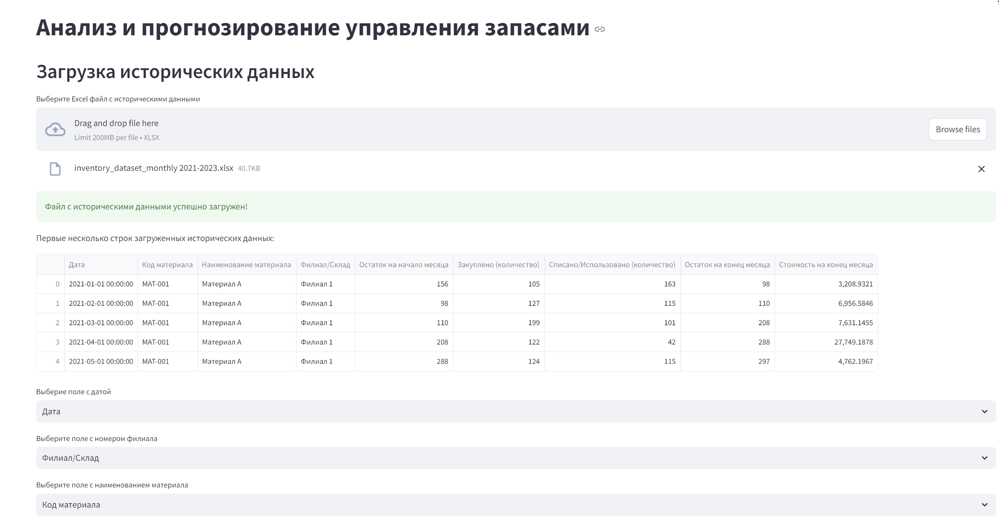
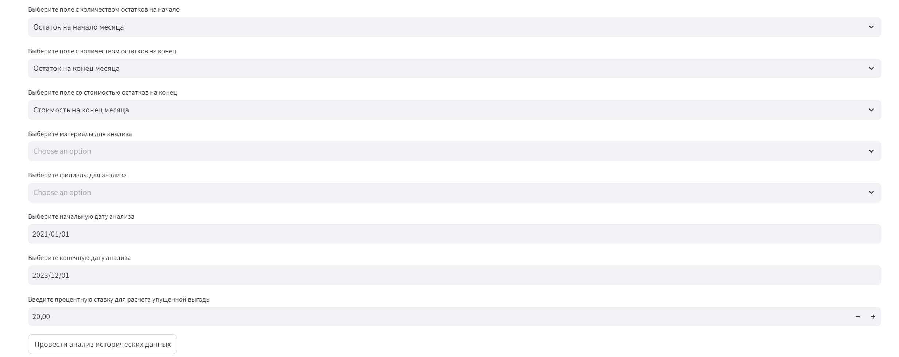
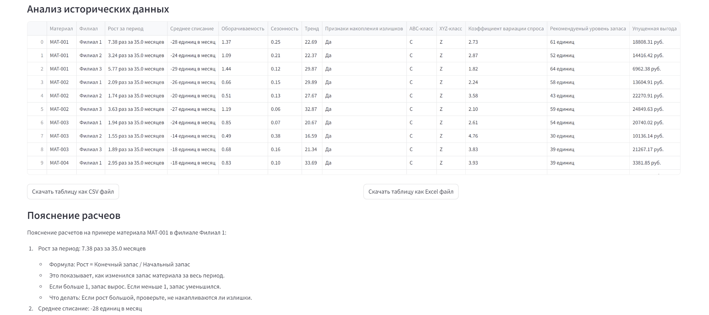
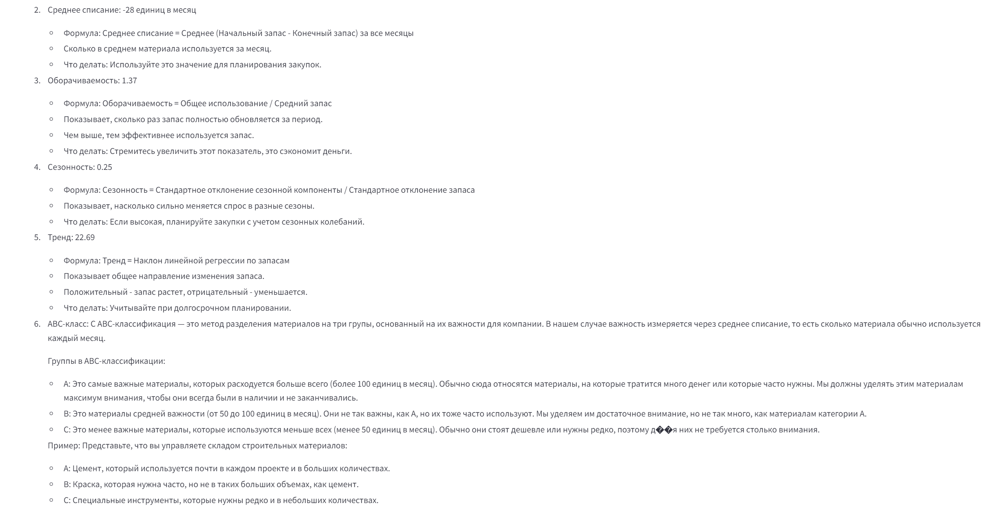
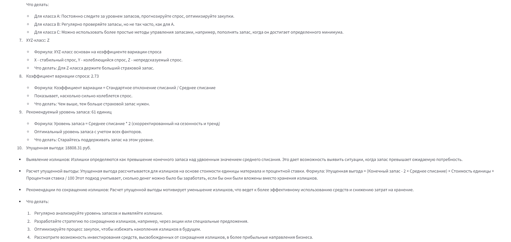
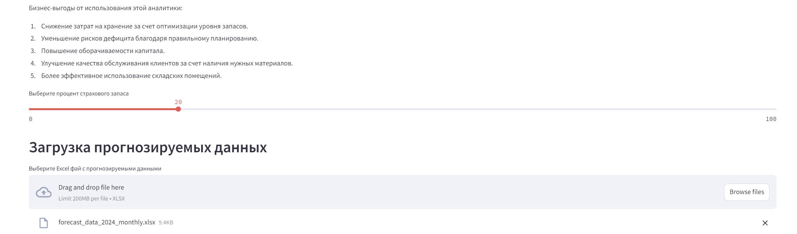
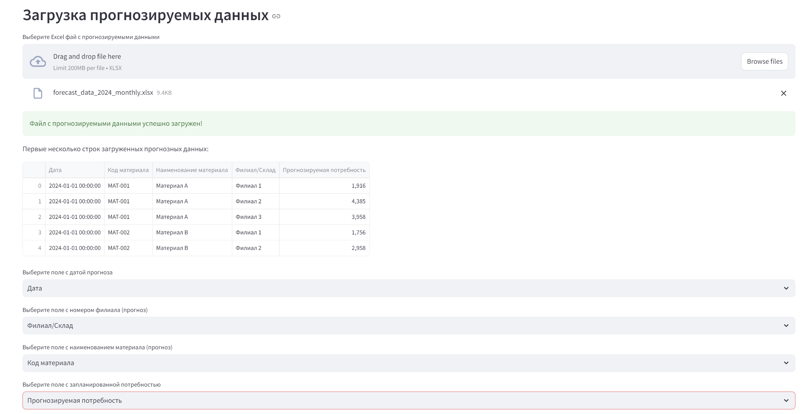
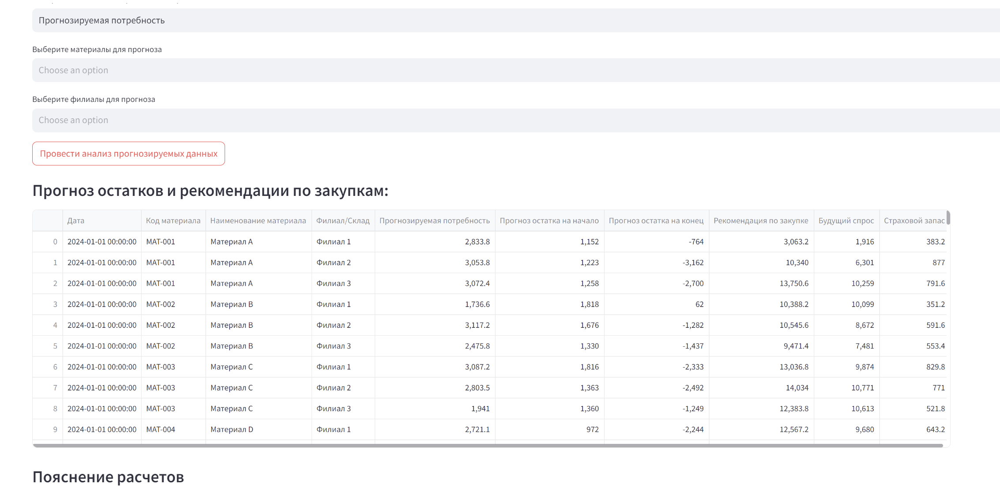
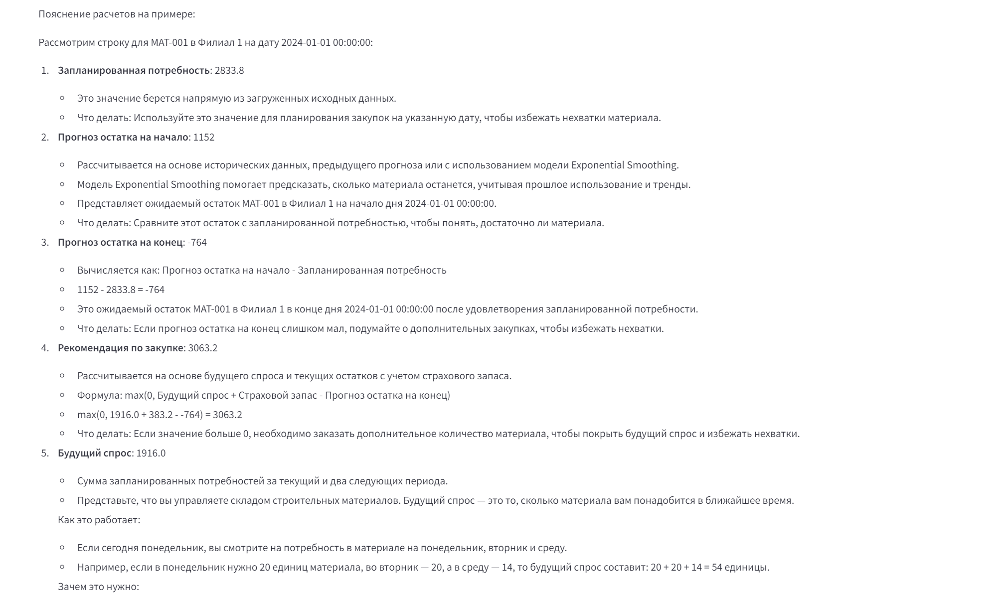
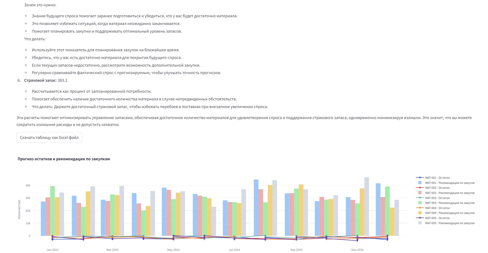

# analysis


## Описание работы приложения

Приложение предназначено для анализа и прогнозирования управления запасами. Оно предоставляет подробные расчеты как для исторических данных, так и для прогнозных значений, что позволяет оптимизировать управление запасами, снижать затраты и улучшать качество обслуживания клиентов.

### Прототип приложения

Прототип приложения доступен по ссылке: [демонстрация приложения](https://analysis-a3zrrazdzpdimvjh2edcwa.streamlit.app)

### Исторические данные

Приложение анализирует исторические данные и предоставляет следующие расчеты:

### Скриншоты исторических данных








#### Пояснение расчетов на примере материала MAT-001 в филиале Филиал 1:

- **Рост за период: 7.38 раз за 35.0 месяцев**
  - **Формула:** Рост = Конечный запас / Начальный запас
  - **Описание:** Показывает, как изменился запас материала за весь период. Если больше 1, запас вырос. Если меньше 1, запас уменьшился.
  - **Рекомендация:** Если рост большой, проверьте, не накапливаются ли излишки.

- **Среднее списание: -28 единиц в месяц**
  - **Формула:** Среднее списание = Среднее (Начальный запас - Конечный запас) за все месяцы
  - **Описание:** Сколько в среднем материала используется за месяц.
  - **Рекомендация:** Используйте это значение для планирования закупок.

- **Оборачиваемость: 1.37**
  - **Формула:** Оборачиваемость = Общее использование / Средний запас
  - **Описание:** Показывает, сколько раз запас полностью обновляется за период. Чем выше, тем эффективнее используется запас.
  - **Рекомендация:** Стремитесь увеличить этот показатель, это сэкономит деньги.

- **Сезонность: 0.25**
  - **Формула:** Сезонность = Стандартное отклонение сезонной компоненты / Стандартное отклонение запаса
  - **Описание:** Показывает, насколько сильно меняется спрос в разные сезоны.
  - **Рекомендация:** Если высокая, планируйте закупки с учетом сезонных колебаний.

- **Тренд: 22.69**
  - **Формула:** Тренд = Наклон линейной регрессии по запасам
  - **Описание:** Показывает общее направление изменения запаса. Положительный - запас растет, отрицательный - уменьшается.
  - **Рекомендация:** Учитывайте при долгосрочном планировании.

- **ABC-класс: C**
  - **Описание:** ABC-классификация — это метод разделения материалов на три группы, основанный на их важности для компании. В нашем случае важность измеряется через среднее списание, то есть сколько материала обычно используется каждый месяц.
  - **Группы в ABC-классификации:**
    - **A:** Самые важные материалы, которых расходуется больше всего (более 100 единиц в месяц).
    - **B:** Материалы средней важности (от 50 до 100 единиц в месяц).
    - **C:** Менее важные материалы, которые используются меньше всех (менее 50 единиц в месяц).
  - **Рекомендации:**
    - Для класса A: Постоянно следите за уровнем запасов, прогнозируйте спрос, оптимизируйте закупки.
    - Для класса B: Регулярно проверяйте запасы, но не так часто, как для A.
    - Для класса C: Можно использовать более простые методы управления запасами, например, пополнять запас, когда он достигает определенного минимума.

- **XYZ-класс: Z**
  - **Формула:** XYZ-класс основан на коэффициенте вариации спроса
  - **Описание:** X - стабильный спрос, Y - колеблющийся спрос, Z - непредсказуемый спрос.
  - **Рекомендация:** Для Z-класса держите больший страховой запас.

- **Коэффициент вариации спроса: 2.73**
  - **Формула:** Коэффициент вариации = Стандартное отклонение списаний / Среднее списание
  - **Описание:** Показывает, насколько сильно колеблется спрос.
  - **Рекомендация:** Чем выше, тем больше страховой запас нужен.

- **Рекомендуемый уровень запаса: 61 единиц**
  - **Формула:** Уровень запаса = Среднее списание * 2 (скорректированный на сезонность и тренд)
  - **Описание:** Оптимальный уровень запаса с учетом всех факторов.
  - **Рекомендация:** Старайтесь поддерживать запас на этом уровне.

- **Упущенная выгода: 4702.08 руб.**
  - **Описание:** Излишки определяются как превышение конечного запаса над удвоенным значением среднего списания. Это дает возможность выявить ситуации, когда запас превышает ожидаемую потребность.
  - **Формула:** Упущенная выгода = (Конечный запас - 2 × Среднее списание) × Стоимость единицы × Процентная ставка / 100
  - **Рекомендации:**
    - Регулярно анализируйте уровень запасов и выявляйте излишки.
    - Разработайте стратегию по сокращению излишков, например, через акции или специальные предложения.
    - Оптимизируйте процесс закупок, чтобы избежать накопления излишков в будущем.
    - Рассмотрите возможность инвестирования средств, высвобожденных от сокращения излишков, в более прибыльные направления бизнеса.

### Прогнозные значения

Приложение также предоставляет расчеты для прогнозных значений:

### Скриншоты прогнозных значений






#### Пояснение расчетов на примере:

Рассмотрим строку для MAT-002 в Филиал 1 на дату 2024-01-01 00:00:00:

- **Запланированная потребность: 1736.6**
  - **Описание:** Это значение берется напрямую из загруженных исходных данных.
  - **Рекомендация:** Используйте это значение для планирования закупок на указанную дату, чтобы избежать нехватки материала.

- **Прогноз остатка на начало: 1818**
  - **Описание:** Рассчитывается на основе исторических данных, предыдущего прогноза или с использованием модели Exponential Smoothing. Модель Exponential Smoothing помогает предсказать, сколько материала останется, учитывая прошлое использование и тренды.
  - **Рекомендация:** Сравните этот остаток с запланированной потребностью, чтобы понять, достаточно ли материала.

- **Прогноз остатка на конец: 62**
  - **Формула:** Прогноз остатка на начало - Запланированная потребность
  - **Описание:** Это ожидаемый остаток MAT-002 в Филиал 1 в конце дня 2024-01-01 00:00:00 после удовлетворения запланированной потребности.
  - **Рекомендация:** Если прогноз остатка на конец слишком мал, подумайте о дополнительных закупках, чтобы избежать нехватки.

- **Рекомендация по закупке: 2045.2**
  - **Формула:** max(0, Будущий спрос + Страховой запас - Прогноз остатка на конец)
  - **Описание:** Рассчитывается на основе будущего спроса и текущих остатков с учетом страхового запаса.
  - **Рекомендация:** Если значение больше 0, необходимо заказать дополнительное количество материала, чтобы покрыть будущий спрос и избежать нехватки.

- **Будущий спрос: 1756.0**
  - **Описание:** Сумма запланированных потребностей за текущий и два следующих периода.
  - **Рекомендация:** Используйте этот показатель для планирования закупок на ближайшее время. Убедитесь, что у вас есть достаточно материала для покрытия будущего спроса.

- **Страховой запас: 351.2**
  - **Описание:** Рассчитывается как процент от запланированной потребности. Помогает обеспечить наличие достаточного количества материала в случае непредвиденных обстоятельств.
  - **Рекомендация:** Держите достаточный страховой запас, чтобы избежать перебоев в поставках при внезапном увеличении спроса.

### Поля датасетов

Для корректной работы приложения необходимо подавать на вход следующие поля датасетов:

#### Исторические данные:
- `date_column`: Дата
- `branch_column`: Филиал
- `material_column`: Материал
- `start_quantity_column`: Начальный запас
- `end_quantity_column`: Конечный запас
- `end_cost_column`: Стоимость на конец периода

#### Прогнозные данные:
- `date_column`: Дата
- `branch_column`: Филиал
- `material_column`: Материал
- `demand_column`: Запланированная потребность

### Динамическое пояснение расчетов

Пояснение расчетов в этом приложении происходит динамически. Это означает, что если ваш набор данных содержит другие данные, приложение будет их брать за основу для выполнения расчетов и предоставления рекомендаций.

### Бизнес-выгоды от использования этой аналитики:

- Снижение затрат на хранение за счет оптимизации уровня запасов.
- Уменьшение рисков дефицита благодаря правильному планированию.
- Повышение оборачиваемости капитала.
- Улучшение качества обслуживания клиентов за счет наличия нужных материалов.
- Более эффективное использование складских помещений.

## Установка

Рекомендуется использовать `conda` для управления зависимостями и создания изолированной среды. Следуйте этим шагам для настройки проекта:

1. Установите [Anaconda](https://www.anaconda.com/products/distribution) или [Miniconda](https://docs.conda.io/en/latest/miniconda.html).

2. Клонируйте репозиторий:
    ```sh
    git clone https://github.com/mihnin/analysis.git
    ```

3. Перейдите в директорию проекта:
    ```sh
    cd analysis
    ```

4. Создайте и активируйте новую среду:
    ```sh
    conda create --name analysis python=3.12 -y
    conda activate analysis
    ```

5. Установите зависимости:
    ```sh
    pip install -r requirements.txt
    ```

## Использование

1. Запустите приложение Streamlit:
    ```sh
    streamlit run app.py